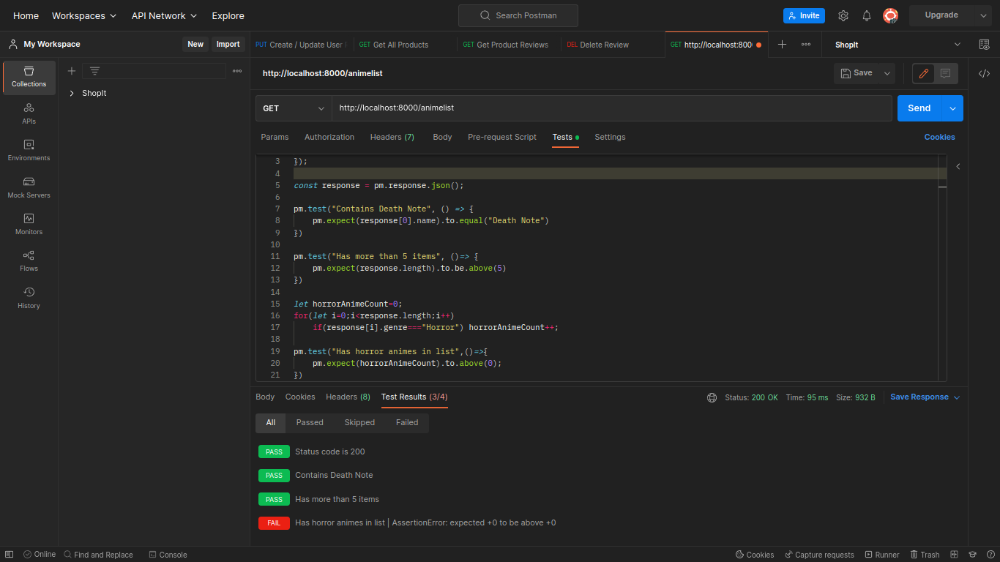

# Keploy Task 5
Build a webapp using HTML, CSS ,Nodejs and express to serve custom built RESTful API and add MongoDB database to it. Add write test cases for different scenarios using Postman.

## To setup follow these steps:
### Frontend -
```sh
cd frontend
npm install
node app.js
```

### Backend -
```sh
cd backend
npm install
node index.js
```

Now the app is running successfully, to access it http://localhost:3000.

### Screenshot -
